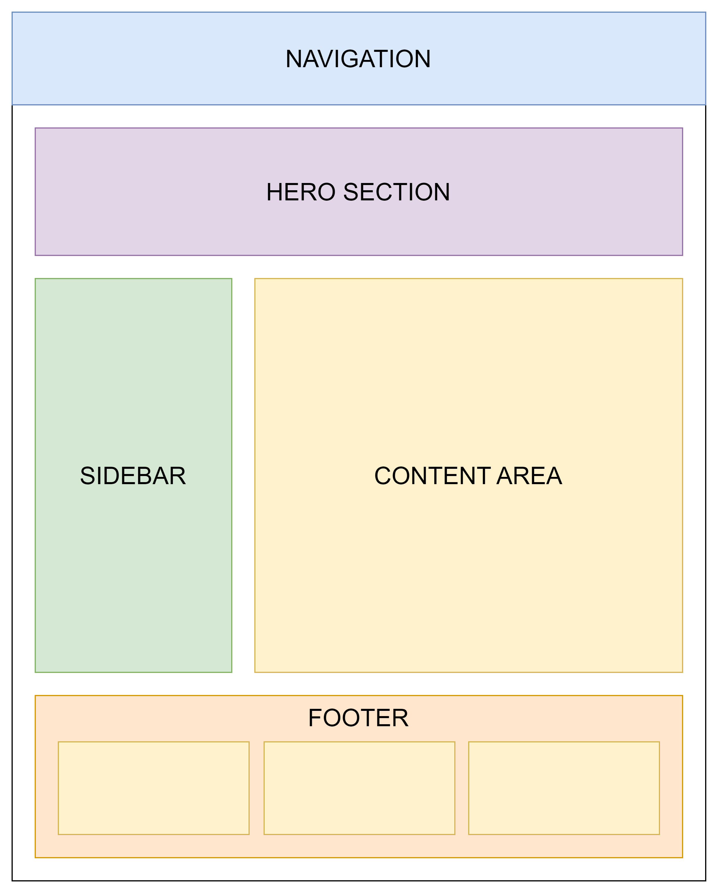
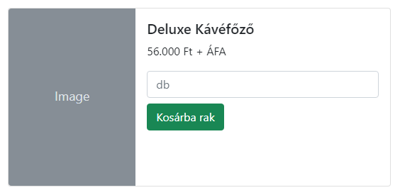

# Házi feladat 01

    Sipos Miklós - 2024 - Kliensoldali fejlesztés

## Statikus weboldalak létrehozása

Valósítsa meg a következő leírásnak és mintaképeknek megfelelően a feladatot, HTML és CSS segítségével. A feladat elvégzésekor használhat Bootstrap keretrendszert, viszont ahol a feladat egyértelműen kéri, ott saját CSS megoldást alkalmazzon.

## Elvárások, kikötések

### Strukturális elvárások

A mellékelt képen látható oldalstruktúrát alakítson ki grid elrendezés segítségével. Ehhez használhat saját CSS-t is, de Bootstrap segítségével is megvalósítható. Előbbi esetében javasolt használni online elérhető grid generátor eszközöket.

### Navigációval kapcsolatos elvárások

- hozza létre a következő navigációs elemeket
  - Home, Contact, Products, Cart, Login, Sign up
- a gombok mellett Bootstrap icons segítségével helyezzen egy-egy megfelelő ikont

### Tartalmi elvárások

A megfelelő "dobozokat" saját tartalommal töltse ki.

- a hero section-ben használjon valamilyen Bootstrap carousel-t
- a sidebar-ban link-szerű almenüket jelenítsen meg a bal oldalt ikonokkal kiegészítve
- a content area-ban valamilyen tényleges tartalmat jelenítsen meg
- a footer-ben legyen egy három-osztatú oszlopos elrendezés, ahol a bal oszlopban legyen egy telefonos és email elérhetőség, a középsőben legyen a saját neve és egy copyright jel, a jobb oldaliban pedig legyen egy input mező és egy gomb (hírlevél feliratkozás)

### Reszponzivitással kapcsolatos elvárások

Az oldalt készítse fel, hogy kisebb képernyő esetén is jól jelenjenek meg az elemek. Ehhez vagy használjon saját CSS-t és media query-ket, vagy pedig a megfelelő Bootstrap osztályokat.

### Aloldalak

#### Login

A főoldalon a login menüpontra kattintva egy Bootstrap modal ablak ugorjon fel, ahol felhasználónév és jelszó segítségével be lehetne jelentkezni egy gombnyomást követően.

#### Products

A főoldalon a products menüpont navigáljon át a products.html oldalra, amelyet építsen fel a mintákban látható Bootstrap card-ok segítségével. Legyen legalább 5-6 db termék.

#### Contact

A főoldalon a contact menüpont navigáljon át a contact.html oldalra, ahol különböző ügyek kapcsán lehet felvenni a kapcsolatot. Alakítsa ki a következők mentén:

- legyen egy beviteli mező a névnek
- legyen egy beviteli mező az email címnek
- legyen egy legördülő lista amiből a következőket lehet választani:
  - Termék meghibásodás
  - Raktárkészlet kérdés
  - Összeszerelés
  - Egyéb
- legyen egy jelölőnégyzet miszerint garanciális problémáról van szó
- legyen egy több soros beviteli mező, ahol hosszabb szöveget lehet írni
- legyen egy gomb amivel az üzenetet lehetne elküldeni
- legyen alul, a gomb alatt egy Google Maps térkép beágyazva, amely mutassa a Neumann Kar címét

### Saját CSS elvárások

A következő paramétereket saját CSS-ben állítsa be:

- az oldal maximális szélessége 1111px legyen
- alkalmazzon valahol legalább egy tetszőleges Google font-ot
- a footer-ben megadott saját névre, ha az egérmutatóval rámutatunk, akkor CSS transition segítségével valamilyen látványos módon változzon meg a név (mozogjon, forogjon stb.)
- a sidebar-ban található almenü elemekre, ha az egérmutatóval rámutatunk, akkor jelenjen meg drop shadow

### Minta képek

#### Oldal felépítése

#### Termék card felépítése

