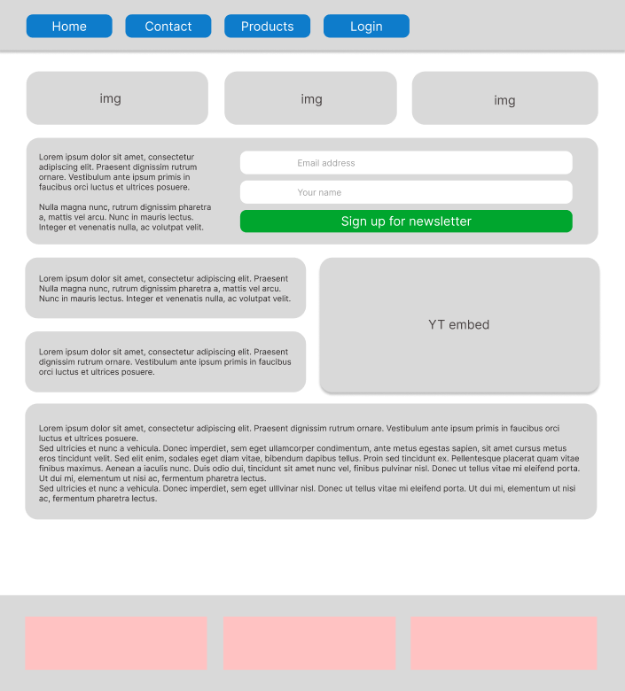
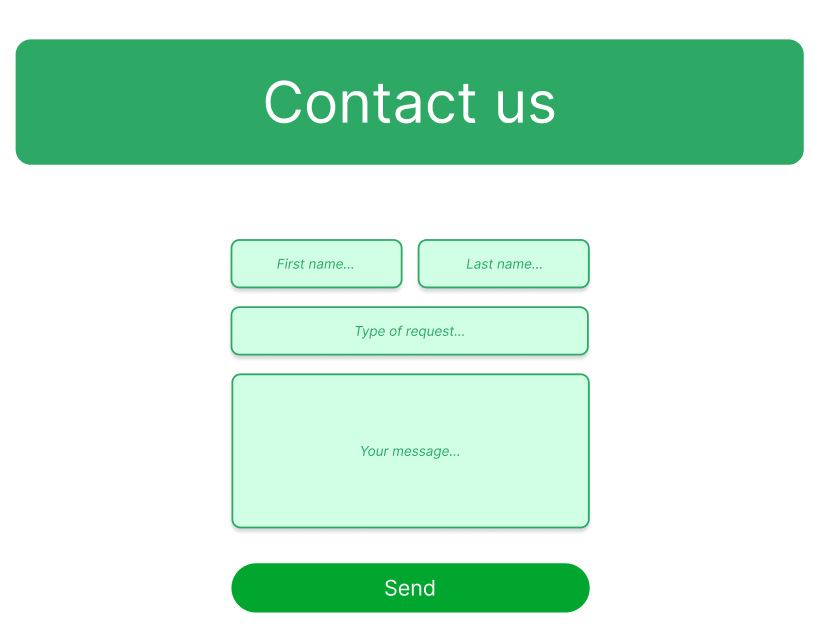

# Workshop #1

| Kliensoldali fejlesztés | |
|-----|---|
| Feldolgozandó modulok: | modul-1, modul-2 |
| Témakörök: | HTML, CSS |
| Cím: | Saját HTML és CSS segítségével történő weboldal kialakítása |
| Félév: | 2023 tavaszi félév |
| Oktató: | Sipos Miklós |

## Feladat

Hozza létre az alábbi ábrán látható elrendezést HTML és CSS segítségével, majd a szükséges módosításokat végezze el a kikötéseknek megfelelően. Azok a részek amik kinézete nincsen egzaktul specifikálva, tetszőlegesen megvalósíthatók.

### Elvárások, kikötések
 - **általános**
    - az oldal max szélessége 1000px
    - az oldalon található elemek legyenek lekerekítettek mint a mintán
    - alkalmazzon egy tetszőleges google font-ot
    - színvilág tekintetében a coolors segítségével generáljon tetszőleges ugyanakkor összeillő színeket, amelyből
    - a mintán jelzett szürke dobozok háttere legyen valamilyen viszonylag világos pasztell színű
    - a navigációs gombok rendelkezzenek ehhez a kékhez hasonló színerősségű színnel
    - a zöld login gomb színe legyen valamilyen kiugró szín amire egyből felfigyel az ember
- **navigáció**
    - a navigációs gomboknál amikor az egérmutató csak a gomb felett áll, akkor tegyen a gombra drop shadow-t és a gombot emelje meg pár pixellel
    - a kattintás pillanatában a drop shadow legyen inset típusú és a gomb mozduljon el lefelé (lenyomást imitálva)
    - a szövegek mellett bal oldalon jelenjen meg minden menüpontnak megfelelően 1 db icon a fontawesome segítségével
- **tartalom**
    - a középső dobozban legyen két input mező és egy gomb amivel hírlevélre lehet(ne) feliratkozni
    - a login gombra víve az egeret a gomb emelkedjen meg és lassan kezdjen el “növekvő / kiemelkedő” hatást elérni
    - az egeret rávíve bármelyik szürke dobozra az oldal törzsében, az adott div alatt jelenjen meg drop shadow (egy minta erre a YT embed-nél látható a képen)
    - a három img helyére kerüljön három darab kép oly módon, hogy pontosan töltse ki a teret
        - [hint](https://www.w3schools.com/cssref/css3_pr_background-size.php)
    - egy tetszőleges youtube videó legyen beágyazva, szintén lekerekített sarokkal és csak az őt tartalmazó div rendelkezzen valamilyen gradiens átmenettel fentről lefelé
    - a szöveggel jelölt helyeknél legyen szöveg
    - a footerben a három piros blokk helyét töltse ki tetszőleges adatokkal amelyből egy helyen egy google maps legyen embeddelve ami mutasson egy tetszőleges címre
- **reszponzivitás**
    - az oldalt készítse fel, hogy kisebb képernyő esetén is jól jelenjenek meg az elemek
    - ehhez állapítson meg egy ideális töréspontot és hozza létre hozzá a megfelelő CSS módosításokat
    - kisebb nézetben a menüelemek csússzanak egymás alá, és ugyan ez legyen igaz a törzsben található elemekre is
    - a hírlevél feliratkozós résznél a bal oldalt található szöveg ne jelenjen meg, csak az input mezők és a gomb
- **aloldal**
    - a főoldalon a contact menüpont navigáljon át a contact.html oldalra amelyet a minta alapján építsen fel
    - a felső input mezőben lehet megadni a vezeték és keresztnevet (first name, last name)
    - a középső legyen egy legördülő lista amiből a panasz típusát lehet kiválasztani
        - Product malfunction
        - Warranty problems
        - Installment help
        - Other
    - az alsó egy inputmező amiben több sorban ki lehet fejteni az üzenetet
    - valamint egy gomb ami elküldené a beírt adatokat

### Figma terv / minta

[A mintát itt lehet tetszőlegesen zoomolható méretben megtekinteni.](https://www.figma.com/file/sJz7iPn0M9dbiWy7H7Hx3q/frontend-demo?node-id=0%3A1&t=e96on3VqfF3GnqNe-1)

